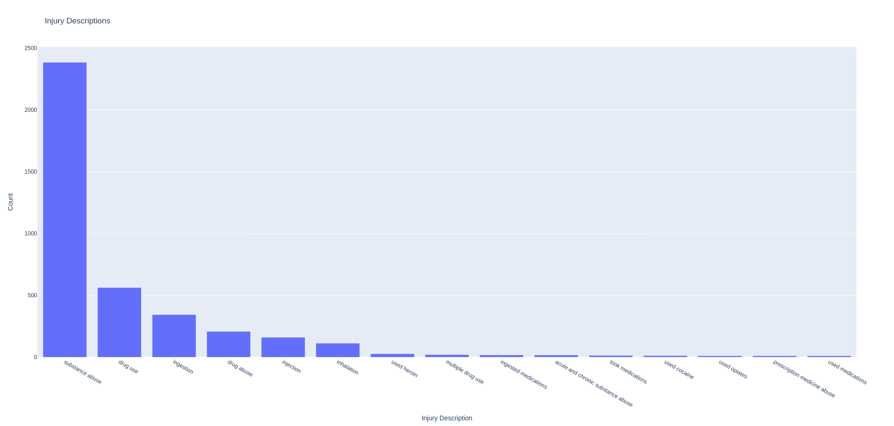
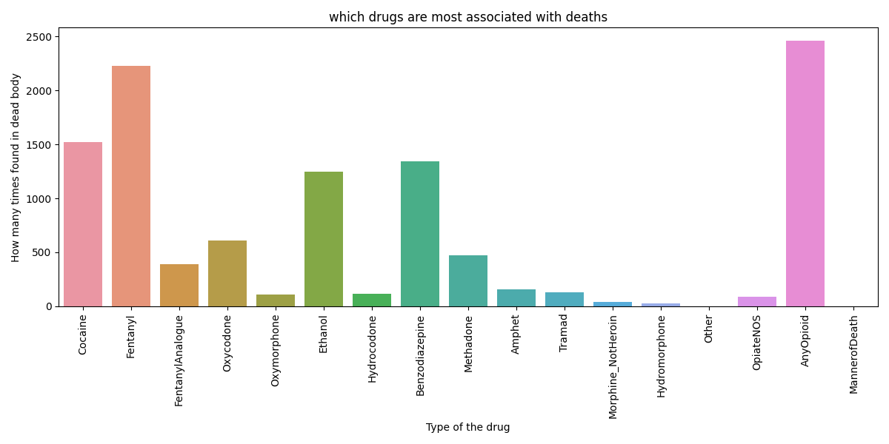

# DataAnalysis
Exploring correlations and analyses in various datasets. **Datasets source**: https://code.datasciencedojo.com/datasciencedojo/datasets

# Accidental-Drug-Related-Deaths.py

**Libraries**
- pandas
- matplotlib
- seaborn
- plotly

**Visualisations**
1. Drugs Associated with Deaths Bar Chart: This bar chart visualizes the drugs most associated with deaths. It provides 
   insights into which drugs are frequently found in deceased individuals.
2. Drug-Related Deaths by Gender Bar Chart: This bar chart shows the number of drug-related deaths by gender, helping us
   understand the gender distribution of these deaths
3. Heatmap of Drug-Related Deaths in Cities and Counties: This heatmap presents the distribution of drug-related deaths 
   across cities and counties in Connecticut. The color intensity indicates the number of deaths in each city-county combination.
4. Deaths by Location Bar Chart: This bar chart displays the percentage death rate for different locations such as hospitals,
   residences, and other places.
5. Top Injury Descriptions Interactive Bar Chart: An interactive bar chart generated using Plotly Express. It displays 
   the most frequent injury descriptions and allows you to interact with the visualization. You can change 'bars_number'
   parameter to choose how many bars you want to compare.

**Example**

